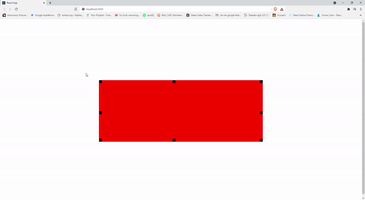

# A simples element in reactjs with point events

This project was bootstrapped with [Create React App](https://github.com/facebook/create-react-app).

#To Install:

### `yarn install`

#To run:

In the project directory, you can run:

### `yarn start`

#If asks for a depencendy:

### `yarn add typescript`
